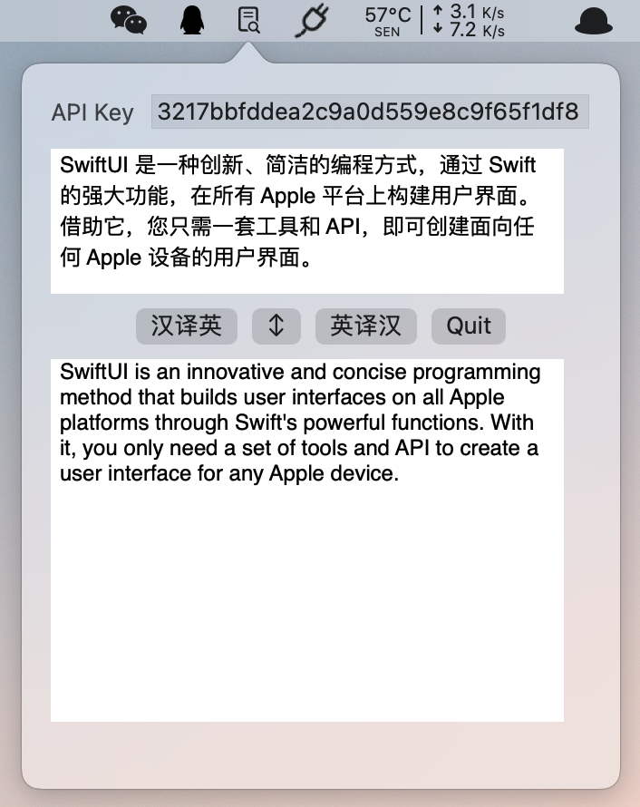

# FastTrans
A simple translation application on macOS platform.
## Requirements
* Xcode 12.0+
* Alamofire 5.4.0+
* macOS Big Sur
## Usage
* 在 https://niutrans.com 注册一个账号，并获得 `API Key`。
* 编译运行后填入你的 `API Key` 后即可使用，也可将 `FastTrans/Home.swift` 文件中 `@State private var apikey` 的默认值设置为你的 `API Key` 后再编译。
## Effect Drawing

